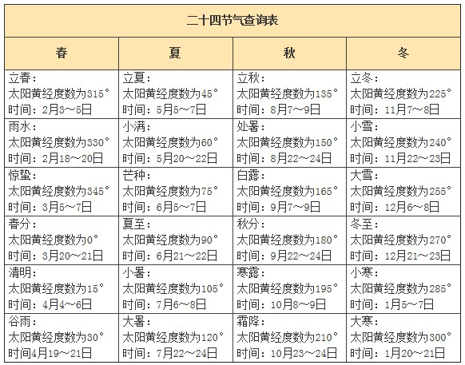
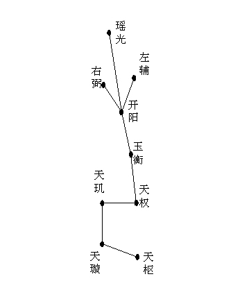
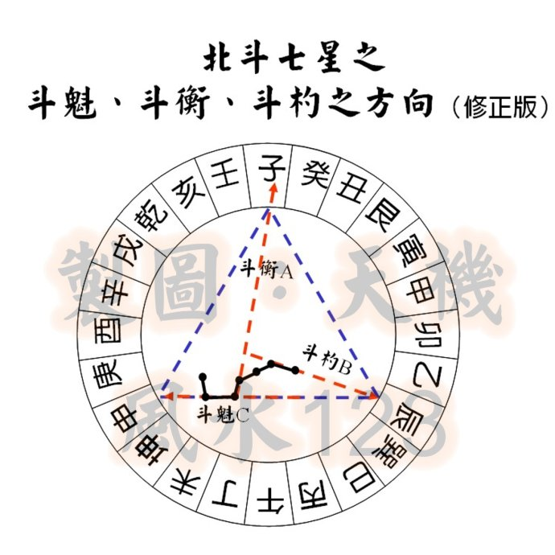
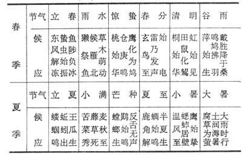
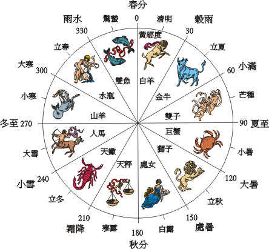

# 二十四节气

二十四节气指二十四时节和气候。

## 名称

二十四个节气的名称，是随着斗纲所指的地方并结合当时的自然气候与景观命名而来的。

所谓斗纲，就是北斗七星中的魁、衡、杓三颗星随着天体的运行，
斗纲指向不同的方向和位置，其所指的位置就是所代表的月份。
如正月为寅，黄昏时杓指寅，半夜衡指寅，白天魁指寅；二月为卯，黄昏时杓指卯，半夜衡指卯，白天魁指卯，其余的月份类推。

## 中气与月份

二十四节气中，冬至、大寒、雨水、春分、谷雨、小满、夏至、大暑、处暑、秋分、霜降、小雪为中气，通常用来确定月份。
冬至所在月份为冬月、大寒所在月份为腊月、雨水所在月份为正月、春分所在月份为二月、……小雪所在月份为十月，复至冬至所在月份冬月。

### 闰月

中气之间的时间约为30日5.25时，因此中气日之间的间隔（含前不含后）为30或31日。
而一个月的时间为29日或30日，一个月内要么一个中气要么没有中气。
因此，中气可以直接来确定月份及闰否，无中气的月份为前一个月的闰月。

## 定气

现代二十四节气沿用定气，即以黄道升交点春分点为起点0度（但排序仍习惯上把立春列为首位），按黄经度数编排。

二十四节气的公历日期每年大致相同：上半年在6日、21日前后，下半年在8日、23日前后。

通式寿星公式——[Y×D+C]-L
Y=年代数、D=0.2422、L=闰年数、C取决于节气和年份。
本世纪立春的C值=4.475，求2017年的立春日期如下：
[2017×0.2422+4.475]-[2017/4-15]=492-489=3
所以2017年的立春日期是2月3日。

## 七十二候

古代以五日为候，三候为气，六气为时，四时为岁，一年四时二十四气七十二候。

## 二十四风

二十四风，又称二十四番花信风，因为是应花期而来的风，所以叫信。

* 小寒：一候梅花、二候山茶、三候水仙；
* 大寒：一候瑞香、二候兰花、三候山矾；
* 立春：一候迎春、二候樱桃、三候望春；
* 雨水：一候菜花、二候杏花、三候李花；
* 惊蛰：一候桃花、二候棠梨、三候蔷薇；
* 春分：一候海棠、二候梨花、三候木兰；
* 清明：一候桐花、二候麦花、三候柳花；
* 谷雨：一候牡丹、二候酴糜、三候楝花。

## 节气与星座
跟二十四节气相似，古代的黄道十二宫亦是以春分点为起点而把黄道分为12等份，
因此占星学中十二星座（本质是黄道十二宫）与二十四节气中的十二个中气不谋而合，一一对应。
但黄道十二宫是时间段而不是时点。

