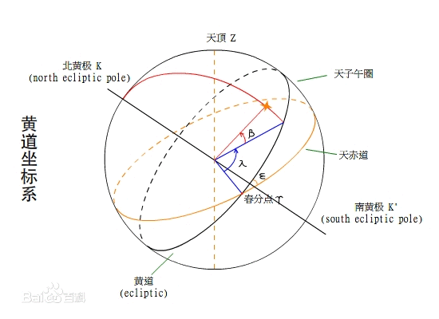
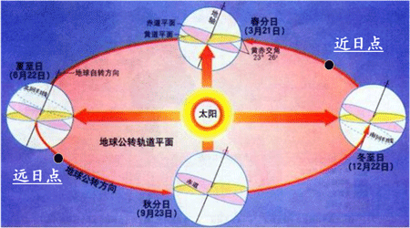

# 入门

## 天球

### 地平圈
通过地心且垂直于当地铅垂线的平面与天球相割所成大圆。

* 天顶
* 天底

### 天赤道
赤道平面与天球相割所成大圆。

* 北天极
* 南天极

### 卯酉圈
天赤道与地平圈相交于东点和西点。

通过东、西点，天顶、天底的大圆为卯酉圈。
以天顶和天底分隔成卯圈（东半圈）和酉圈（西半圈）。

### 黄道
地球绕日公转轨道平面与天球相割所成大圆。

* 黄北极
* 黄南极

### 子午圈
通过南、北天极，天顶、天底的大圆。

子午圈与地平圈相交于北点和南点，
以天顶和天底分隔成子圈（北半圈）和午圈（南半圈）。

## 分至与回归

## 周日视运动

相对于地球不动的概念，天球上的物体也是每24小时围绕着天极旋转的。
这就是昼夜运动，太阳、行星、卫星等等都是东升西落,这称为天球的周日视运动.

因为地球有公转的缘故，一颗恒星总是比它前一天提前约4分钟升起，月亮平均每天比前一天晚升起50分钟。

>TODO:提前或晚多长时间升起是什么意思？

### 北极星

北极星靠近北天极。

* 北极星的仰视角不变。
* 仰视角与纬度相等。

所以，任一地方，北极星出现在天空的位置是不会变化的。
当然，南半球就看不到了。

